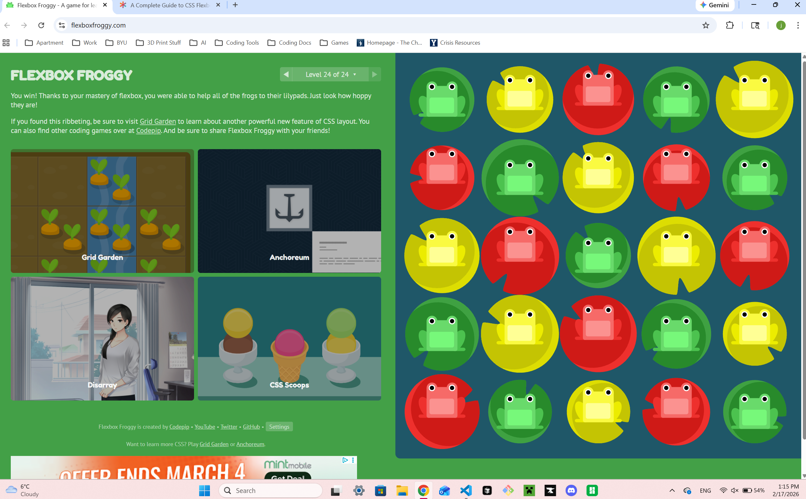
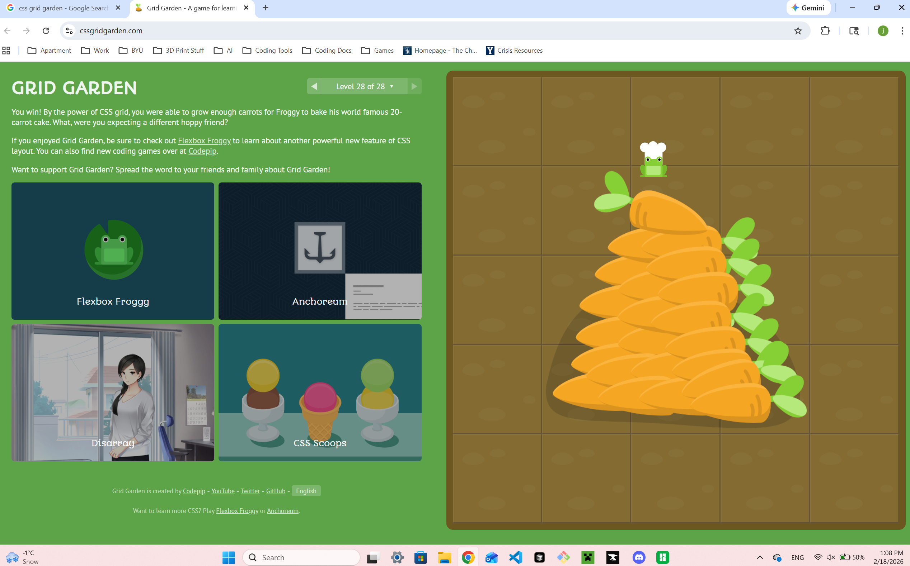

# HW 6 - James Day

SURVEY COMPLETED

## Flexbox Froggy and Grid Garden Completions

## My Explanation

The difference between Flex and Grid are mainly what determines the size and layout of the page. Flex is great for responding to the size of the content contained inside the flex container. However, that makes it bad for things like elements that need a predetermined size. This is what Grid is better for, because the programmer can control the size of the grid cells in a more direct way. Grid can still respond to size changes of the window like Flex, but it may not have as natural of a look because it tries to make each cell size the same (or at least following a grid pattern).

I personally had never used grid before, but it's grown on me. I would say I like Grid better because of the direct sizing control you get over the general page layout. I remember trying to size a page correctly with Flex, and it wasn't easy to get it right. With Grid, however, if you just know a couple of tricks, it's a breeze.
